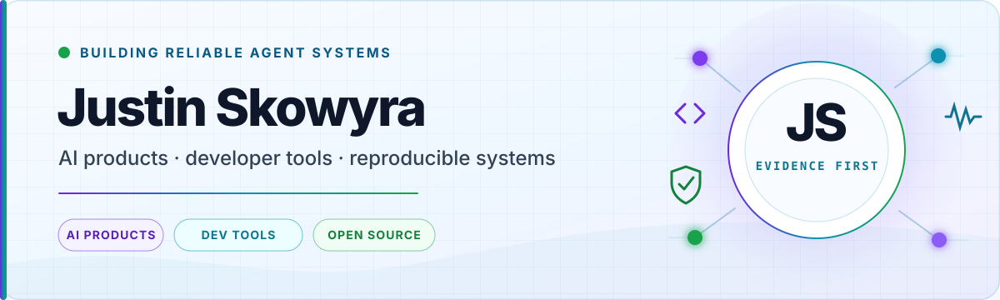

<picture>
  <source media="(prefers-color-scheme: dark) and (max-width: 640px)" srcset="./assets/hero-mobile-dark.svg">
  <source media="(prefers-color-scheme: light) and (max-width: 640px)" srcset="./assets/hero-mobile-light.svg">
  <source media="(prefers-color-scheme: dark)" srcset="./assets/hero-dark.svg">
  <source media="(prefers-color-scheme: light)" srcset="./assets/hero-light.svg">
  
</picture>

# Justin Skowyra

**Software and AI product developer building reliable agent systems, developer tools, and reproducible data products.**

Founder of [Eversko](https://github.com/eversko). I turn real failure reports into exact reproductions, minimal patches, regression tests, and public receipts—currently contributing across the open [DeepSeek Harness](https://github.com/deepseek-ai/deepseek-harness) ecosystem.

  
  
  

## Current work

| Project | Relationship | Stack and current outcome |
| --- | --- | --- |
|  | Maintainer | TypeScript · React · Node.js. Experimental public preview with 191 passing tests and explicit hardware and credential gates. |
|  | Upstream contributor | Rust · Tauri · React. Nine authored pull requests merged; eleven changes named across three official releases. |
|  | Upstream contributor | TypeScript · React. Six authored fixes shipped across two stable releases. |
|  | Maintainer | JavaScript · Node.js · AJV. Pre-activation regression gates with a merged external specification integration. |
|  | Maintainer | Python · TypeScript · React · Cloudflare. Evidence-first Ontario property-tax data product. |
|  | Eversko project | C# · .NET · PowerShell. Windows-first, health-gated Git releases for a single-machine workflow. |

## Core stack

<table>
  <tr>
    <td align="center"><a href="https://www.typescriptlang.org/"> <strong>TypeScript</strong></a></td>
    <td align="center"><a href="https://www.rust-lang.org/"> <strong>Rust</strong></a></td>
    <td align="center"><a href="https://www.python.org/"> <strong>Python</strong></a></td>
    <td align="center"><a href="https://developer.mozilla.org/en-US/docs/Web/JavaScript"> <strong>JavaScript</strong></a></td>
    <td align="center"><a href="https://learn.microsoft.com/dotnet/csharp/"> <strong>C#</strong></a></td>
    <td align="center"><a href="https://learn.microsoft.com/powershell/"> <strong>PowerShell</strong></a></td>
  </tr>
  <tr>
    <td align="center"><a href="https://react.dev/"> <strong>React</strong></a></td>
    <td align="center"><a href="https://tauri.app/"> <strong>Tauri</strong></a></td>
    <td align="center"><a href="https://nodejs.org/"> <strong>Node.js</strong></a></td>
    <td align="center"><a href="https://astro.build/"> <strong>Astro</strong></a></td>
    <td align="center"><a href="https://www.cloudflare.com/developer-platform/"> <strong>Cloudflare</strong></a></td>
    <td align="center"><a href="https://vitest.dev/"> <strong>Vitest</strong></a></td>
  </tr>
</table>

Agent systems · Desktop applications · Plugin architecture · Data pipelines · Release engineering · CI/CD · Security boundaries

## Current release: DSH Live Voice

[DSH Live Voice](https://github.com/Jstn-1g/dsh-live-voice) is a consent-first voice add-on for DeepSeek Harness: an exact-session, bounded manual Qwen audio turn with explicit recording, transcript-promotion, and teardown boundaries.

**Experimental public preview** · **191 tests passing** · **official DSH CLI install verified** · **independently included in the ecosystem handbook**

[Preview release](https://github.com/Jstn-1g/dsh-live-voice/releases/tag/v0.3.0-preview.1) · [Harness community launch](https://github.com/deepseek-ai/deepseek-harness/discussions/4958) · [Independent handbook inclusion](https://github.com/sandbaseai/deepseek-harness-handbook/releases/tag/v0.5.396) · [Open safety gates](https://github.com/Jstn-1g/dsh-live-voice/issues/5)

> The preview label is deliberate. Credential-backed Qwen, physical-device, BFCache, and packaged-Desktop validation remain open release gates.

## Open-source impact, with receipts

**23 merged patches** · **10 independently maintained DSH projects** · **14 stable release credits plus 4 current prerelease credits** · **800+ GitHub contributions**

| Surface | Verified outcome |
| --- | --- |
| **DeepSeek Harness Desktop** | Nine authored pull requests merged. Eleven changes are named across [v0.9.0](https://github.com/dsh-tauri-desk/deepseek-harness-desktop/releases/tag/v0.9.0), [v0.9.2](https://github.com/dsh-tauri-desk/deepseek-harness-desktop/releases/tag/v0.9.2), and [v0.9.3-beta.1](https://github.com/dsh-tauri-desk/deepseek-harness-desktop/releases/tag/v0.9.3-beta.1), spanning desktop UX, package discovery, plugin integrity, release validation, Git update correctness, and process-exit reporting. |
| **DSH Market** | Six fixes merged and released across [v1.19.0](https://github.com/dsh-market/dsh-market/releases/tag/v1.19.0) and [v1.36.0](https://github.com/dsh-market/dsh-market/releases/tag/v1.36.0): safer installs and updates, Windows reliability, profile handling, and clearer marketplace behavior. |
| **Broader ecosystem** | Upstream fixes landed in plugin tooling, memory, context compression, provider usage, subscriptions, and Desktop extensions. Every claim is linked in the [verified contribution ledger](CONTRIBUTIONS.md). |

## Engineering signature

`reproduce → isolate → patch → regression-test → publish the receipt`

I prefer exact source baselines, causal negative controls, deterministic tests, and status labels that distinguish **shipped**, **merged**, **adopted**, **preview**, and **under review**.

<strong>Open the verified contribution record</strong>

The full [contribution ledger](CONTRIBUTIONS.md) links primary release notes, merged pull requests, independent adoption, and work still under review. It is updated conservatively: no merge, release, or adoption claim appears without a public receipt.

## Build with me

I am open to collaborations around reliable AI products, agent infrastructure, developer experience, and evidence-first public data. Start with [Eversko](https://eversko.com), connect on [LinkedIn](https://www.linkedin.com/in/justin-skowyra/), or email [info@eversko.com](mailto:info@eversko.com).

Profile facts last verified 2026-08-29. Preview and review statuses may change; the linked receipts are authoritative.
